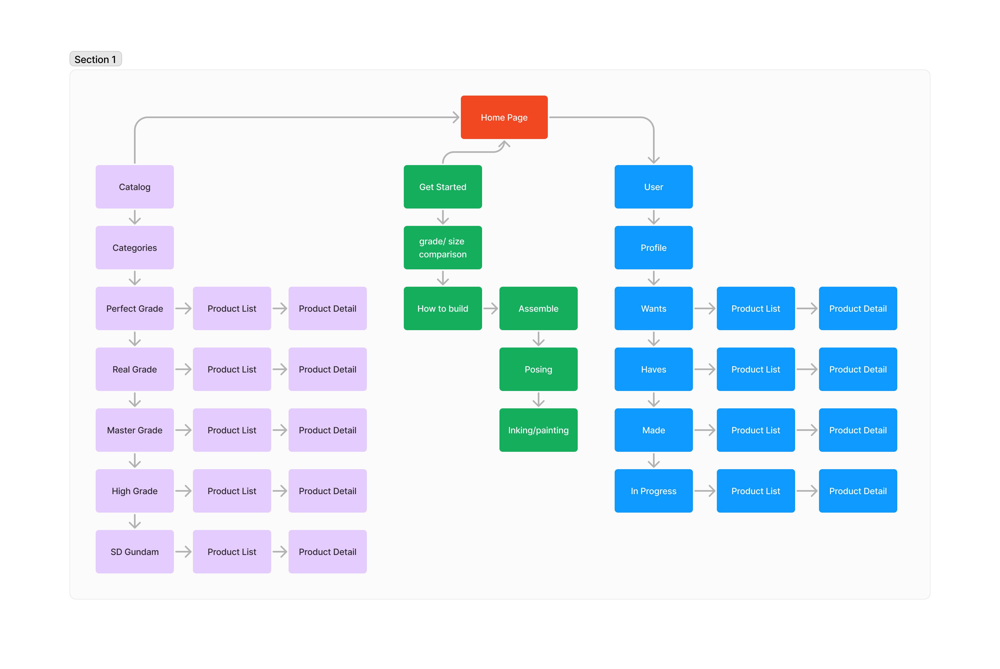
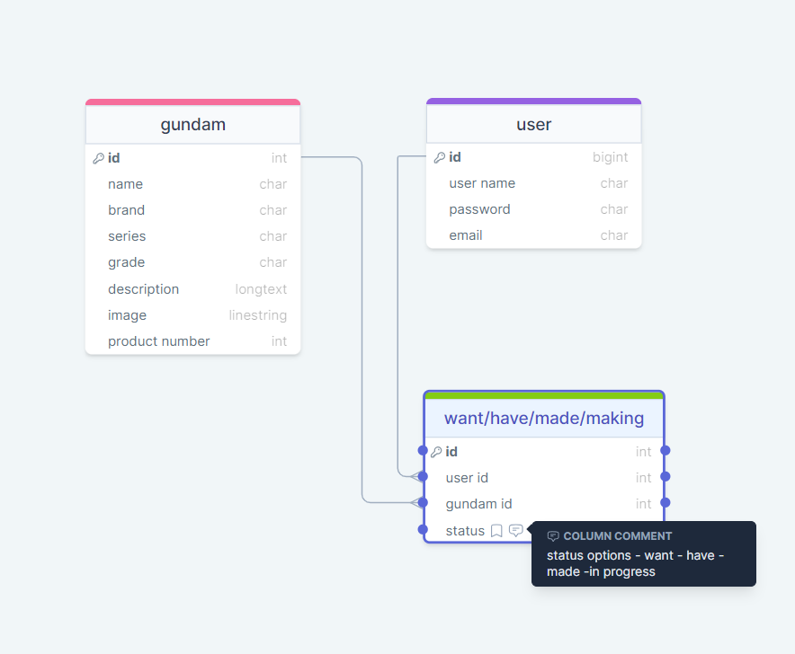

# Project Title

  

## Overview
Keeping a catalogue of Gundam models is essential for any enthusiast. It not only serves as a source of inspiration but also acts as a roadmap for your collection journey. With a comprehensive list, you can easily keep track of the models you own and the ones you've assembled, ensuring you don't miss any in your quest to conquer the Gundam universe. Whether meticulously organizing by series, scale, or grade, a well-maintained catalogue is the ultimate tool for any Gundam builder, ensuring no mobile suit is left behind.

### Problem
Maintaining a catalogue of Gundam models offers several practical benefits for enthusiasts. Firstly, it serves as a personal inventory, allowing you to keep track of the models you own, which can be particularly helpful if you have a sizable collection. This prevents accidentally purchasing duplicates and ensures you can quickly reference which models you already possess.

Secondly, keeping track of the models you've assembled provides a sense of accomplishment and progress in your hobby. It allows you to reflect on your building skills and the diversity of your collection. Additionally, if you enjoy customizing or modifying your models, a catalogue helps you remember which ones you've already worked on and which designs you still want to explore.

Furthermore, a catalogue can be a valuable reference tool when discussing Gundam with fellow enthusiasts. Whether online or in-person, being able to easily reference your collection helps facilitate conversations about specific models, techniques, or favorite designs.

Overall, maintaining a catalogue of Gundam models enhances organization, facilitates personal reflection, and enriches the enjoyment of the hobby for enthusiasts of all levels.

### User Profile
The target users for my Gundam model catalogue app would primarily be Gundam enthusiasts, hobbyists, and collectors. These individuals may vary in their level of expertise, ranging from beginners who are just starting their collection to seasoned veterans with extensive experience in building and customizing Gundam models.

The app would be designed to cater to the diverse needs of these users. Here's how they might use it:

**Cataloguing Collection**: Users can input details of the Gundam models they own, including the model name, series, scale, grade, and any additional notes or customizations they've made. They can easily browse and search through their collection, making it convenient to reference which models they already possess.

**Building Progress Tracker**: For models that users are currently building or plan to build in the future, the app can include a feature to track the progress of each build. Users can mark off completed steps, set reminders for upcoming stages, and record any challenges or modifications encountered during the build process.

**Wishlist Management**: The app can include a wishlist feature where users can add Gundam models they aspire to own or build in the future. This could include upcoming releases, rare models, or designs they find particularly appealing.

**Community Interaction**: To foster a sense of community among Gundam enthusiasts, the app can include social features such as forums, chatrooms, or a photo-sharing platform where users can showcase their builds, exchange tips and techniques, and engage in discussions about their favorite Gundam models and series.

Special considerations that our app must take into account include:

**User-Friendly Interface**: The app should have an intuitive and easy-to-navigate interface, especially for users who may not be tech-savvy. Clear categorization and labeling of features are essential to ensure users can quickly access the functionalities they need.

**Customization Options**: Since Gundam enthusiasts often enjoy personalizing their models, the app should allow users to customize their profile, organize their collection in various ways, and add personalized notes or tags to each model entry.

**Offline Access**: While an internet connection may not always be available, especially during Gundam-building sessions in workshops or conventions, the app should offer offline access to ensure users can still reference their collection and track their progress without interruption.

**Compatibility Across Devices**: The app should be compatible with a range of devices, including smartphones, tablets, and desktop computers, to accommodate different user preferences and ensure seamless access to the catalogue and its features regardless of the device being used.

### Features

**User Registration and Profile Creation:**
 - Users should be able to input basic information such as username, email, and password.
 - Optional profile customization options such as profile picture and bio should be available.

**Catalogue Gundam Models**:
 - Include fields for model name, series, scale, grade, and any additional notes.
 - Users should be able to categorize models by series, scale and grade.

  **Track Building Progress**:
 - Include a checklist or progress bar for each model, allowing users to mark completed steps.
 - Allow users to record any modifications or challenges encountered during the build process.

**Manage Wishlist**:
 - Allow users to add models to their wishlist with details such as model name and series.
   
 **Browse and Search Functionality**:
 - Include a search bar for users to quickly find specific models by name or keyword.
 - Implement filters and sorting options by series, scale, grade, and custom tags.

## Implementation

### Tech Stack

List technologies that will be used in your app, including any libraries to save time or provide more functionality. Be sure to research any potential limitations.	

### APIs
List any external sources of data that will be used in your app.

To gather information to create a database - 
[text](https://www.gundamplanet.com/)
[text](https://satellite.bandai-hobby.net/tips/assemble.php)
[text](https://manual.bandai-hobby.net/)

### Sitemap

### Mockups

### Data

### Endpoints
**For user**
.get /user/:id

.get /user/inprogress
.post /user/inprogress

.get /user/wishlist
.post /user/wishlist

.get /user/haves
.post /user/haves

.get /user/completed
.post /user/completed

**For Catalog**
.get /gundam

.get /gundam/:id
{
    name: 'SD GUNDAM EX-STANDARD RISING FREEDOM GUNDAM',
    brand: 'Bandai',
    series: 'Mobile Suit Gundam SEED',
    grade: 'SD EX-Standard',
    image: ''
    description:'The "Rising Freedom Gundam" that appears in "Mobile Suit Gundam SEED FREEDOM" is made into a three-dimensional SD Gundam EX Standard! Design arrangement unique to SD Gundam EX Standard. Simple transformation to MA form is possible by replacing some parts. Ensures a range of motion that allows for bold action poses. Beam rifle, beam saber, and shield are included. You can customize play with the HG series by combining equipment. Accessories: Beam rifle x1, Beam saber x2, Shield x1, Seal x 1'
}

### Auth
A simple sign-up form to create an account. 

## Roadmap
Scope your project as a sprint. Break down the tasks that will need to be completed and map out timeframes for implementation. Think about what you can reasonably complete before the due date. The more detail you provide, the easier it will be to build.

- creating database of information

- creating catalog section 
    - search function
    - displaying gundam details

- creating user section
    - sign up/ log in
    - profile
    - wants, haves, completed, in progress - displaying the right information
    - in progress detail page

- save gundams to wants or haves list

## Nice-to-haves
Your project will be marked based on what you committed to in the above document. Under nice-to-haves, you can list any additional features you may complete if you have extra time, or after finishing.

- Community Section where you can share tips, notes, pictures.